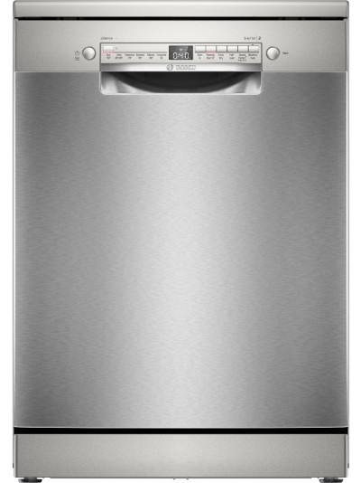

# Smart Dishwasher Challenge

Welcome to the Smart Dishwasher Challenge

## Learning Objectives

- Build a smart dishwasher api to be deployed to a dishwasher appliance
- Use `git` & GitHub to commit work and open a Pull Request

## Dishwasher Programs Values

You'll need these:

| Program      | Water Consumption(litres) | Electric Consumption (kWh per cycle) | Runtime   |
| ------------ | ------------------------- | ------------------------------------ | --------- |
| Intensive 70 | 13.5                      | 1.35                                 | 2.5 hours |
| Eco 50       | 9.0                       | 0.65                                 | 1 hour    |
| Half Load    | 10.5                      | 1.10                                 | 40 mins   |
| Clean Cycle  | 14                        | 1.45                                 | 55 mins   |

## Core Criteria

Ideally your solution should be well commented and contain code to model how the dishwasher will behave.

Include the following:

- GET available programs to run
- POST Program to start (this should not be available if a program is already running)
- GET current running Program including other info e.g. time remaining
- GET last 150 Programs run
- GET usage statistics including total water and electricity consumed, average etc

## Extended Criteria

For some of the extended criteria, pick at least 3 of the following

- DELETE verb so a user can cancel the current program
- GET current running program should be modified to include a message that indicates if the Rinse Aid is running low or empty. Rinse aid runs out for every 40 litres of consumption. Rinse aid capacity is 1 litre.
- GET current running program should be modified to include a message that indicates if the Salt is running low or empty. Salt runs out for every 60 litres of consumption. Salt capacity is 3 litres.
- GET current running program should be modified to include a warning to users that the tablets are running low or gone! Dishwasher tablets come in a box of 63 and each program cycle uses just one tablet.
- GET current running program should be modified to include a warning to users that a clean cycle is recommended. This should occur after 50 hours of dishwasher use or 50 hours since the last clean cycle.

